# Ecommerce App
### An ecommerce app baked with flutter using the Clean Code Architecture and MVVM principles.
This project is build while pursuing the <strong>Flutter Advanced Course - Clean Architecture With MVVM</strong> course on Udemy by <strong>Mina Farid</strong>. 

## Features
<ol>
  <li>Login</li>
  <li>Forgot Password </li>
  <li>Registration</li>
  <li>Validation</li>  
  <li>Exception Handling</li> 
  <li>Functional Programming</li>
  <li>Writing your own rest api and working with it</li>
  <li>Code against the interface</li>
  <li>Localization</li> 
  <li>Clean Code</li>
  <li>MVVM</li>
</ol>

## App Snaps
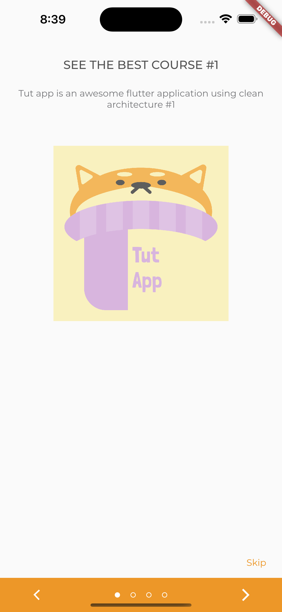 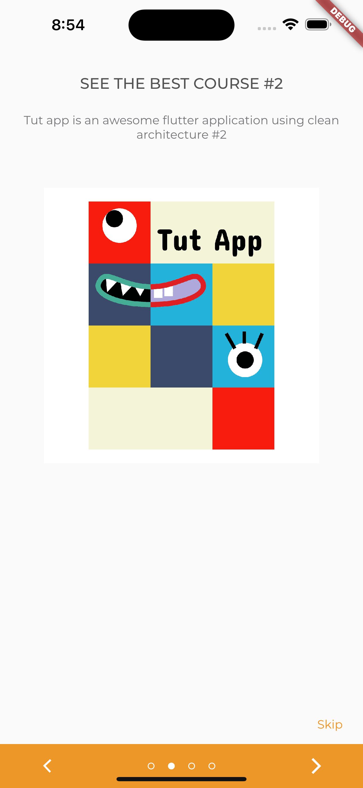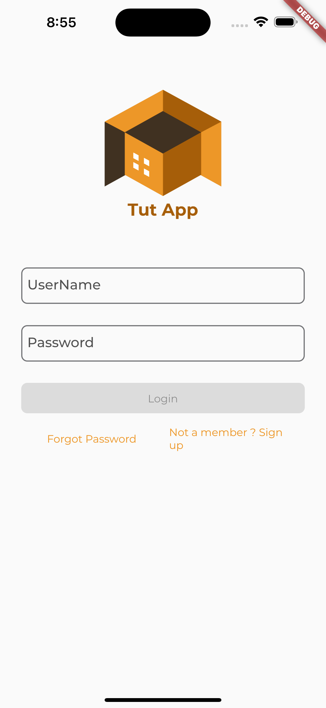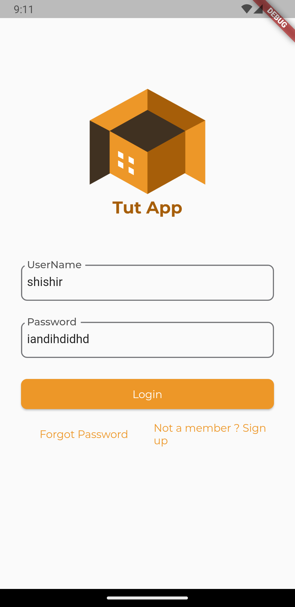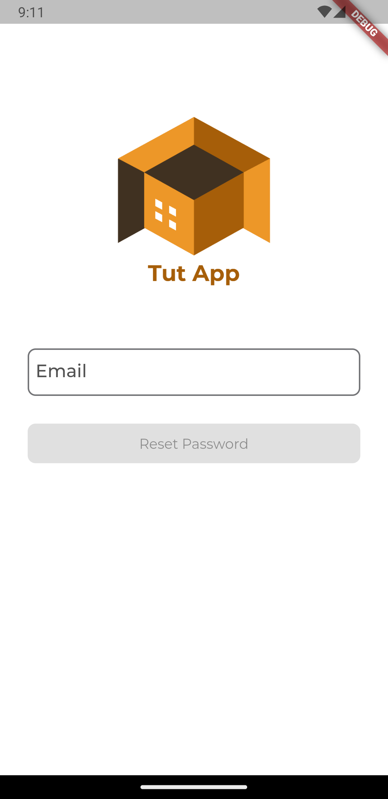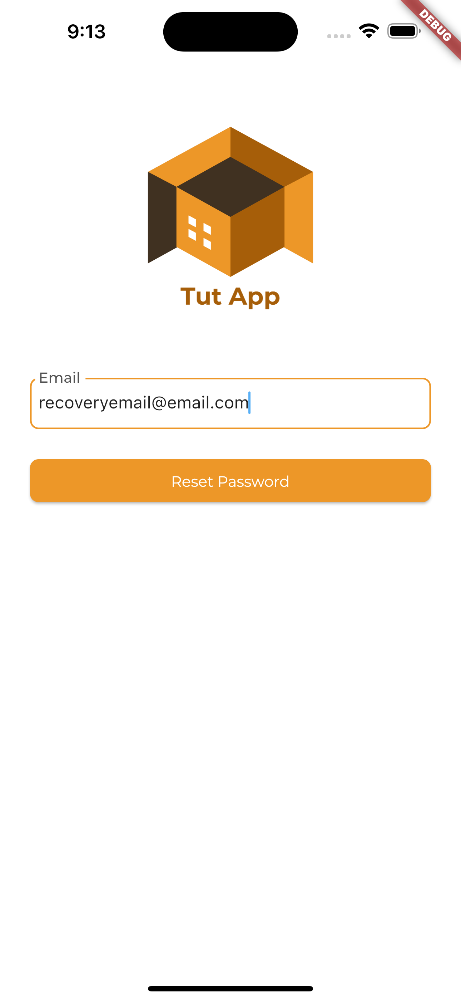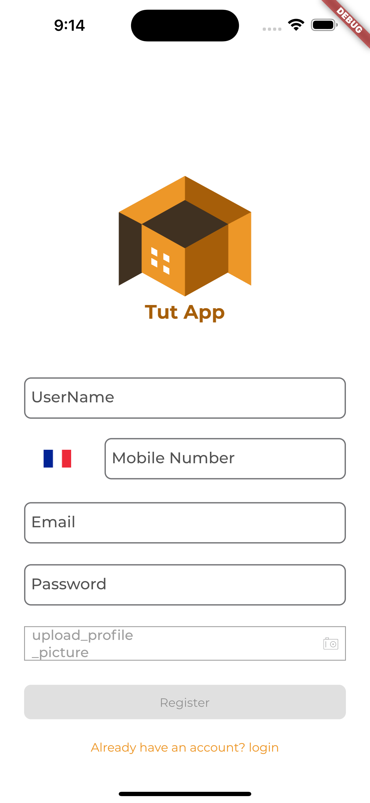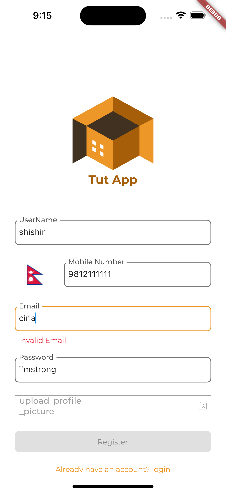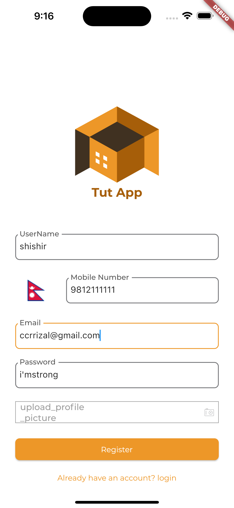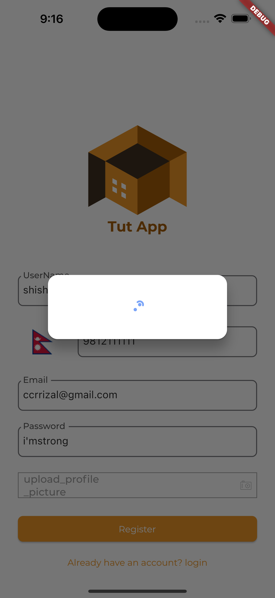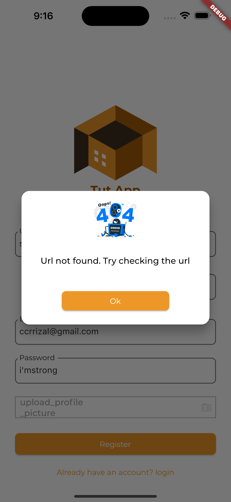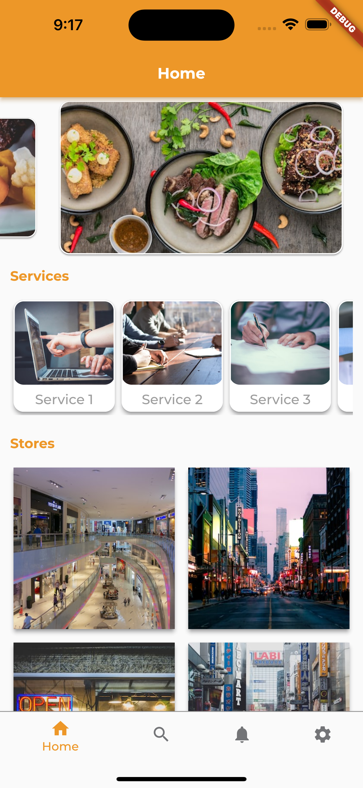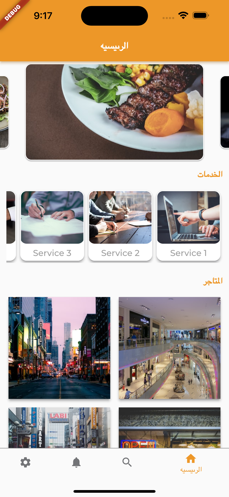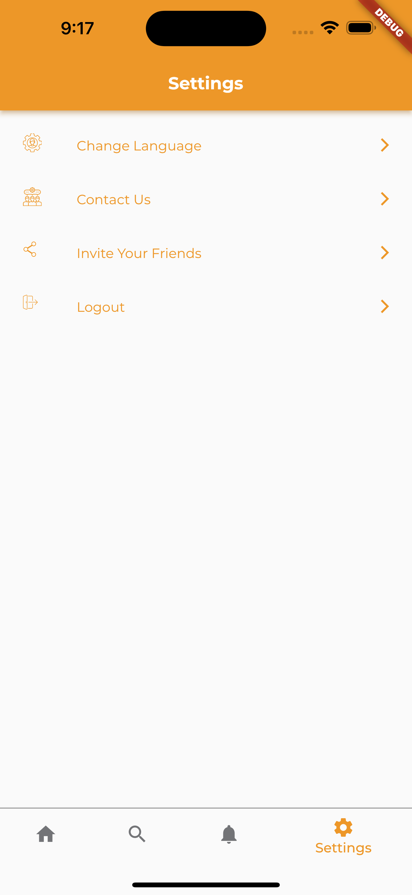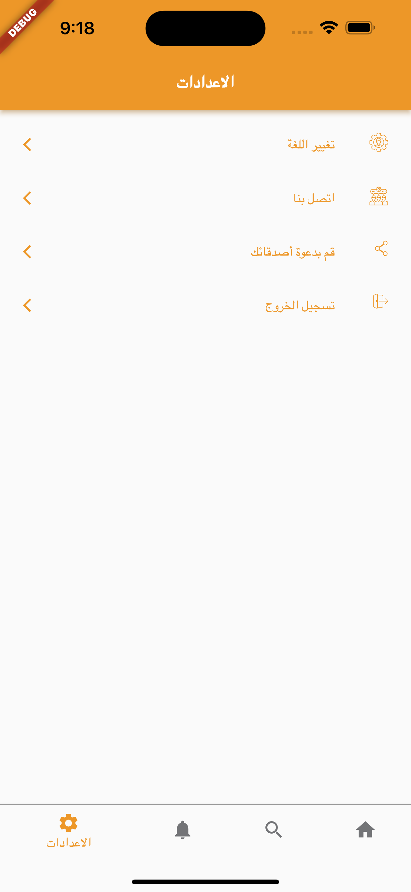
